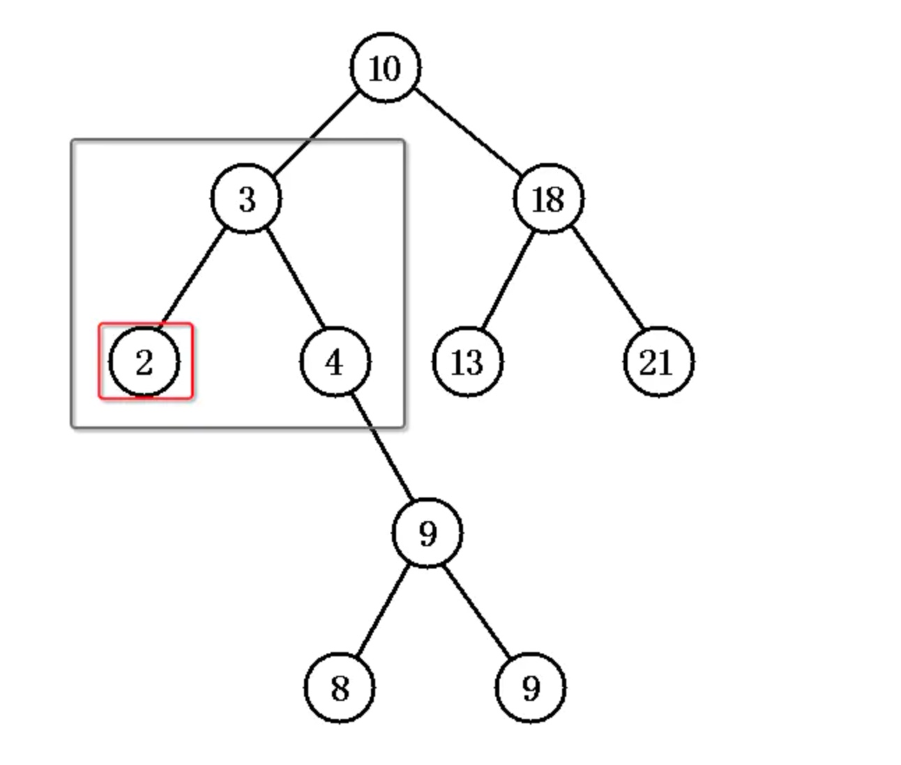
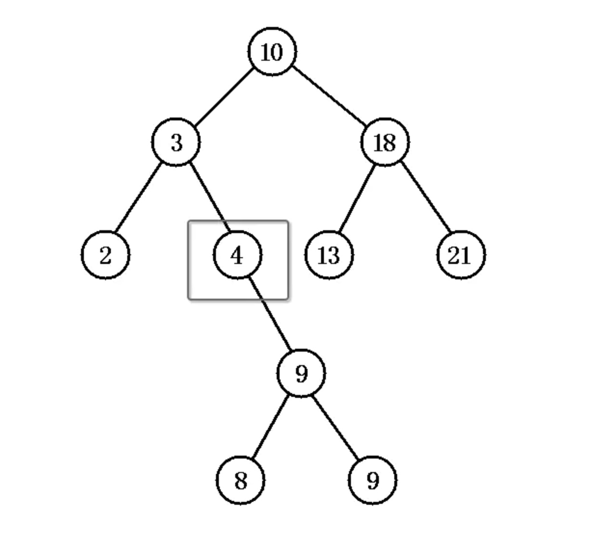
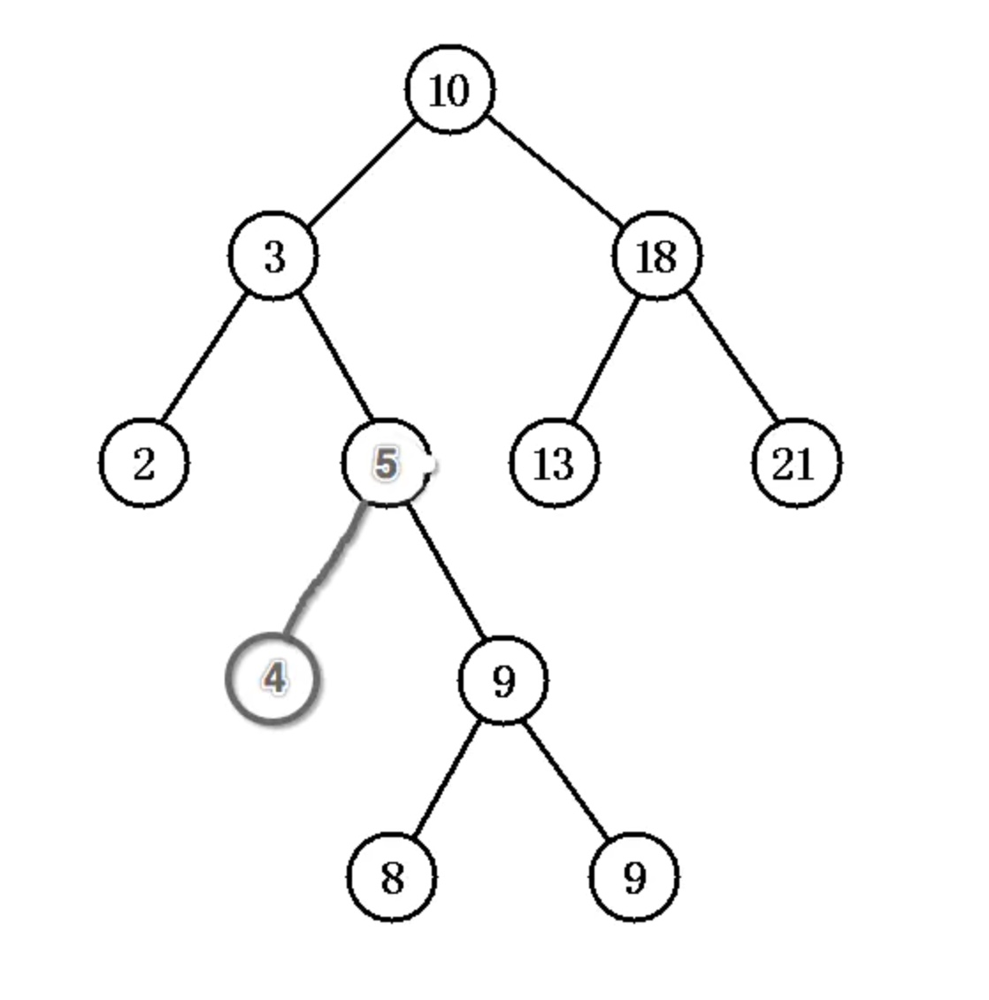
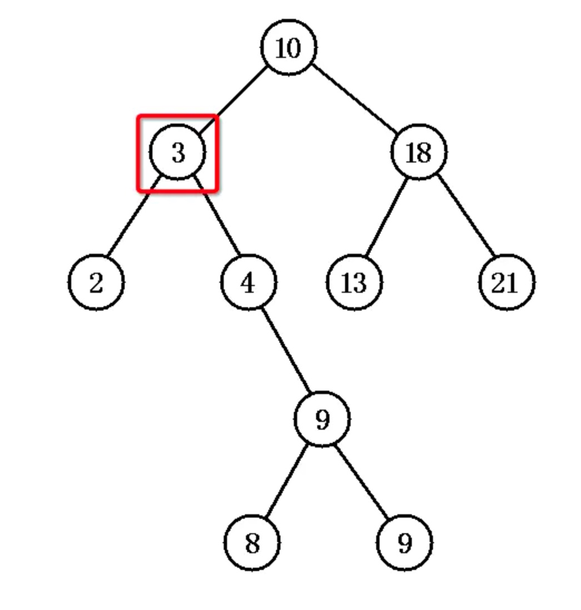
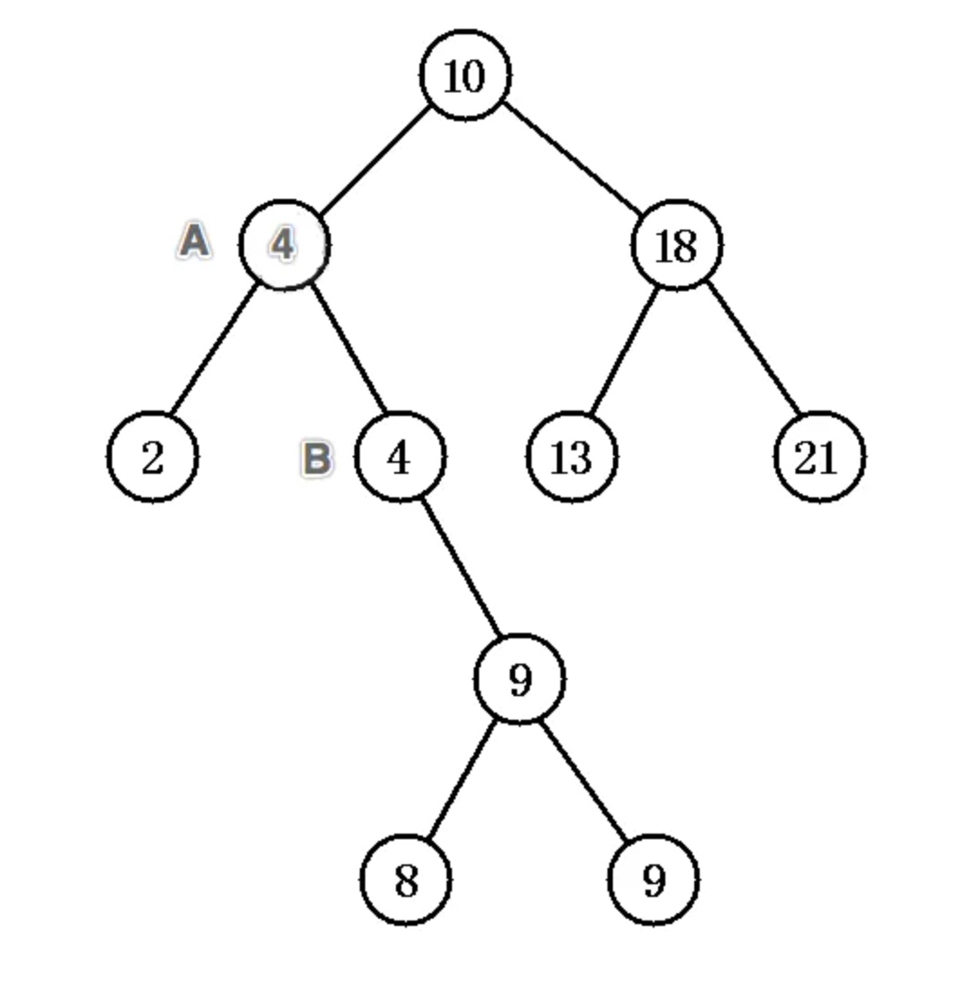
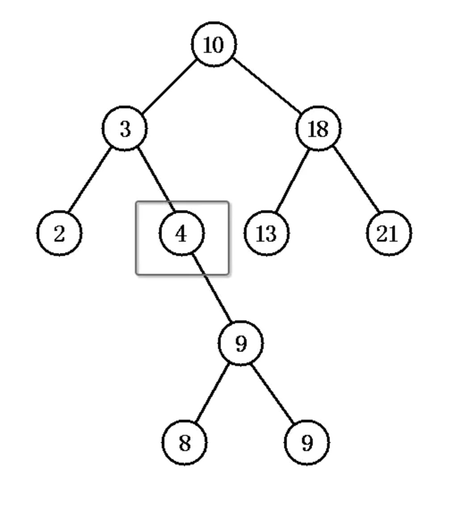
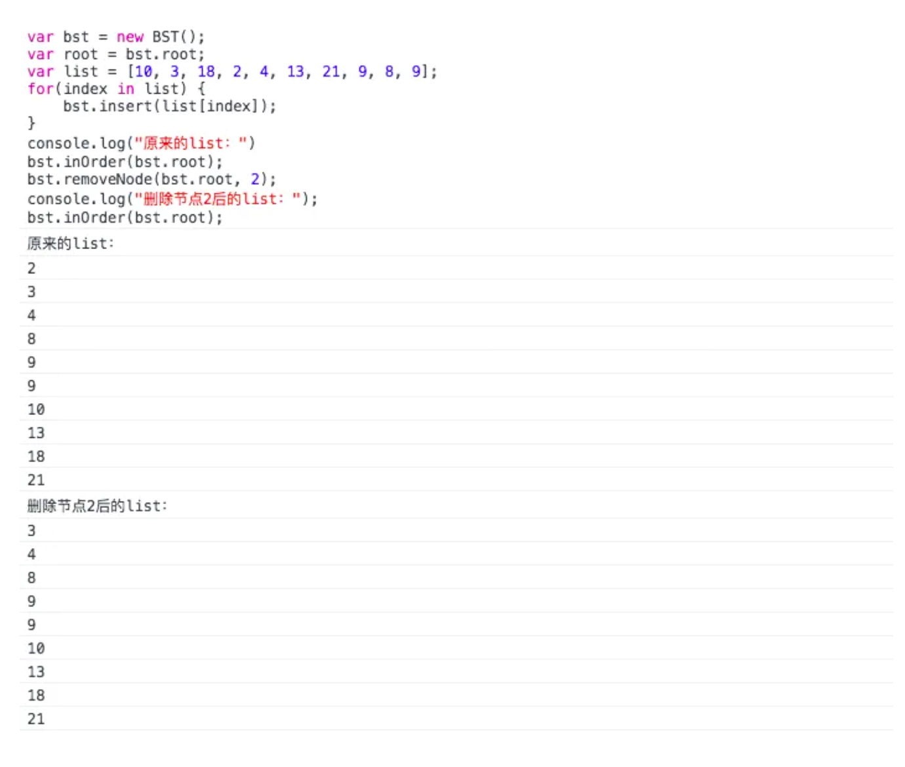

## 二叉树
  树是计算机科学中经常用到的一种数据结构。 树是一种非线性的数据结构， 以分层的方式
存储数据。 树被用来存储具有层级关系的数据， 比如文件系统中的文件； 树还被用来存储
有序列表。 本章将研究一种特殊的树： 二叉树。 选择树而不是那些基本的数据结构， 是因
为在二叉树上进行查找非常快（而在链表上查找则不是这样）， 为二叉树添加或删除元素
也非常快（而对数组执行添加或删除操作则不是这样）


### 树的定义
一棵树最上面的节点称为
根节点， 如果一个节点下面连接多个节点， 那么该节点称为父节点， 它下面的节点称为子
节点。 一个节点可以有 0 个、 1 个或多个子节点。 没有任何子节点的节点称为叶子节点。


二叉树概念

1.除了最下面一层，每个节点都是父节点，每个节点都有且最多有两个子节点；

2.除了嘴上面一层，每个节点是子节点，每个节点都会有一个父节点；

3.最上面一层的节点为根节点；

图例说明：


### 中序遍历概念

先打印左子树（左子节点），接着打印父节点，最后打印右子树（右子节点）

图例说明：


```
<!DOCTYPE html>
<html lang="en">
<head>
    <meta charset="UTF-8">
    <title>Document</title>
</head>
<body>
    <script>
        //创建二叉树
        function Node(data,left,right){
            this.data = data;
            this.left = left;
            this.right = right;
        }
        Node.prototype.show = function(){
            return this.data;
        }
        function BST(){
            this.root = null;
        }
        BST.prototype.insert = function(data){
            var node = new Node(data,null,null);
            if(this.root == null){
                this.root = node;
            }else{
                var current = this.root;
                var parent;
                while(true){
                    parent = current;
                    if(data < current.data){
                        current = current.left;
                        if(current == null){
                            parent.left = node;
                            break;
                        }
                    }else{
                        current = current.right;
                        if(current == null){
                            parent.right = node;
                            break;
                        }
                    }
                }
            }
        }
        //二叉树中序遍历
        BST.prototype.inOrder = function(node){
            if(node){
                this.inOrder(node.left);
                console.log(node.show() + " ");
                this.inOrder(node.right);
            }
        }
        //测试数据
        var bst  = new BST();
        var nums = [10,3,18,2,4,13,21,9,8,9];
        for(var i = 0;i < nums.length;i ++){
            bst.insert(nums[i]);
        }
        bst.inOrder(bst.root);
    </script>
</body>
</html>
```


### 先序遍历概念

先打印父节点，然后是左子节点（左子树），然后再打印右子节点（子树）

图例说明：


 ```
 <!DOCTYPE html>
 <html lang="en">
 <head>
     <meta charset="UTF-8">
     <title>Document</title>
 </head>
 <body>
     <script>
         //创建二叉树
         function Node(data,left,right){
             this.data = data;
             this.left = left;
             this.right = right;
         }
         Node.prototype.show = function(){
             return this.data;
         }
         function BST(){
             this.root = null;
         }
         BST.prototype.insert = function(data){
             var node = new Node(data,null,null);
             if(this.root == null){
                 this.root = node;
             }else{
                 var current = this.root;
                 var parent;
                 while(true){
                     parent = current;
                     if(data < current.data){
                         current = current.left;
                         if(current == null){
                             parent.left = node;
                             break;
                         }
                     }else{
                         current = current.right;
                         if(current == null){
                             parent.right = node;
                             break;
                         }
                     }
                 }
             }
         }
         //二叉树先序遍历
         BST.prototype.perOrder = function(node){
             if(node){
                 console.log(node.show() + " ");
                 this.perOrder(node.left);
                 this.perOrder(node.right);
             }
         }
         //测试数据
         var bst  = new BST();
         var nums = [10,3,18,2,4,13,21,9,8,9];
         for(var i = 0;i < nums.length;i ++){
             bst.insert(nums[i]);
         }
         bst.perOrder(bst.root);
     </script>
 </body>
 </html>
 ```


### 后序遍历概念

首先遍历左子树，然后遍历右子树，最后访问根结点

图例说明：


<!DOCTYPE html>
<html lang="en">
<head>
    <meta charset="UTF-8">
    <title>Document</title>
</head>
<body>
    <script>
        //创建二叉树
        function Node(data,left,right){
            this.data = data;
            this.left = left;
            this.right = right;
        }
        Node.prototype.show = function(){
            return this.data;
        }
        function BST(){
            this.root = null;
        }
        BST.prototype.insert = function(data){
            var node = new Node(data,null,null);
            if(this.root == null){
                this.root = node;
            }else{
                var current = this.root;
                var parent;
                while(true){
                    parent = current;
                    if(data < current.data){
                        current = current.left;
                        if(current == null){
                            parent.left = node;
                            break;
                        }
                    }else{
                        current = current.right;
                        if(current == null){
                            parent.right = node;
                            break;
                        }
                    }
                }
            }
        }
        //二叉树后序遍历
        BST.prototype.postOrder = function(node){
            if(node){
                this.postOrder(node.left);
                this.postOrder(node.right);
                console.log(node.show() + " ");
            }
        }
        //测试数据
        var bst  = new BST();
        var nums = [10,3,18,2,4,13,21,9,8,9];
        for(var i = 0;i < nums.length;i ++){
            bst.insert(nums[i]);
        }
        bst.postOrder(bst.root);
    </script>
</body>
</html>

### 从二叉查找树上删除节点

从 BST 上删除节点的操作最复杂， 其复杂程度取决于删除哪个节点。 如果删除没有子节点
的节点， 那么非常简单。 如果节点只有一个子节点， 不管是左子节点还是右子节点， 就变
得稍微有点复杂了。 删除包含两个子节点的节点最复杂.

为了管理删除操作的复杂度， 我们使用递归操作， 同时定义两个方法： remove() 和
removeNode()。
从 BST 中删除节点的第一步是判断当前节点是否包含待删除的数据， 如果包含， 则删除该
节点； 如果不包含， 则比较当前节点上的数据和待删除的数据。 如果待删除数据小于当前
节点上的数据， 则移至当前节点的左子节点继续比较； 如果删除数据大于当前节点上的数
据， 则移至当前节点的右子节点继续比较。
如果待删除节点是叶子节点（没有子节点的节点）， 那么只需要将从父节点指向它的链接
指向 null。
如果待删除节点只包含一个子节点， 那么原本指向它的节点久得做些调整， 使其指向它的
子节点。
最后， 如果待删除节点包含两个子节点， 正确的做法有两种：<b> 要么查找待删除节点左子树
上的最大值， 要么查找其右子树上的最小值</b>。 这里我们选择后一种方式。
我们需要一个查找子树上最小值的方法， 后面会用它找到的最小值创建一个临时节点。 将
临时节点上的值复制到待删除节点， 然后再删除临时节点。 图 10-7 展示了这一过程。


### 二叉树节点的删除

二叉树节点的删除也是可以分为几种情况:

- 被删除节点为叶子节点；
- 被删除节点仅有一个子节点（子树）；
- 被删除节点有两个子节点（子树）

##### 被删除节点为叶子节点

思路：将该叶子节点的父节点指向的子节点的引用值设为空



以上图为例子，要删除节点 2


```js
console.log(node.data);  // 3
// 删除节点2
node.letf = null;
```

##### 被删除节点仅有一个子树

思路：将该节点的父节点指向该节点的引用改成指向该节点的子节点。




以上图为例子，删除节点4。就是将节点3的node.right 改成 node.right = 节点9

##### 被删除节点有两个子树

思路：处理这种情况有两种方法：

- 从待删除节点的左子树找节点值最大的节点A，替换待删除节点，并删除节点A；
- 从待删除节点的右子树找节点值最小的节点A，替换待删除节点，并删除节点A。

**PS：我们这里选择第二种方法。**
 以下图的二叉树为例，删除节点3。




 按照上面的思路，首先是在节点3的右子树中找节点值最小的节点，我们手动人工智能可以看出节点4就是我们要找的，其实按着二叉树右边小，左边大的特点，就很容易找出来。然后用节点4代替节点5，然后还要删除节点刚找的最小值的节点。最后的结果是：


看到我改了图吧，改一下，让人好点理解嘛，绝不是避开坑专门不说。




 同样是删除节点3，也是用节点4替换，然后就变成了：




 如上面的，要删除原来找到的那个节点值最小的节点B，删除节点B有没有觉得有点眼熟，不就是 **“被删除节点仅有一个子树”** 的情况吗[捂脸]，其实，有没有发现，用节点值为2的节点去替换截止为3的节点更快！


三种情况的解决思路都说完，来看看代码的具体实现：


```js
// 获取给定节点下的二叉树最小值
BST.prototype.getSmallest = function(node) {
    if(node.left == null) {
        return node;
    } else {
        return getSmallest(node.left);
    }
};
// 根据给定删除给定节点下二叉树的对应节点
BST.prototype.removeNode = function(node, data) {
    if(node == null) {
        return null;
    }
    if(data == node.data) {
        // 没有子节点（子树）
        if(node.left == null && node.right == null) {
            return null;
        } 
        // 只有右子节点（子树）
        else if(node.left == null ) {
            return node.right;
        } 
        // 只有左子节点（子树）
        else if(node.right == null){
            return node.left;
        } 
        // 有两个子节点（子树）
        else {
            var tempNode = this.getSmallest(node.right);
            node.data = tempNode.data;
            node.right = this.removeNode(node.right, tempNode.data);
            return node;
        }
    } else if(data < node.data) {
        node.left = this.removeNode(node.left, data);
        return node;
    } else {
        node.right = this.removeNode(node.right, data);
        return node;
    }
}
```

由上面看到这两个方法都是用递归实现的。`removeNode` 递归实现的巧妙之处在于 `return` ，比如说 `node.right = this.removeNode(node.right, data);` 这一句，假设被删除的节点是节点4




 你会发现最后`this.removeNode(node.left, data)`，执行的是下面这段代码：


```js
else if(node.left == null ) {
  return node.right;
} 
```

理一下代码，最后的代码是：`node.right = node.right.right;`，在“不知不觉中”就删除了节点node.right，可以用删除节点4代入一下。node就是节点3，而node.right就是节点4， node.right.right就是节点9。
 最后也是代码测试一下：




